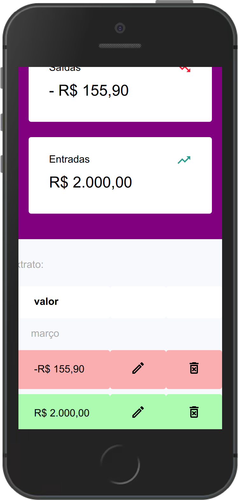

## App Pão Duro 

   Um aplicativo de controle de gastos, que permite  registrar as transações financeiras do usuário durante o mês, armazenando um extrato com as entradas/saídas de valores e apresentando um balanço entre as transações marcadas como ganho e despesa.  

## 1. Interfaces
### Tela principal
   

   Nesta tela, o usuário pode visualizar as transações registradas por ele no aplicativo e um balanço entre as transações marcadas como ganhos e despesa.  

   **operações:**
   Adicionar movimentação, Alterar um registro e excluir uma transação 
  

### Tela de Nova movimentação

    

   Nesta tela, acessível a partir do botão com o ícone de (+) presente no topo da página, o usuário é redirecionado para um formulário de registro das movimentações financeiras. No formulário é possível adicionar uma descrição, valor, tipo (gasto/ganho) e data para o registro.

### Tela de Edição das movimentações

    

   Ao arrastar um dos itens da lista de extrato para esquerda é possível editar ou deletar um registro.
   
  _Botão de edição (ícone de lápis)_: Abre um modal pré-preenchido com os dados do registro selecionado, permitindo alterar seus valores.

   _Botão de exclusão (ícone de lixeira)_: Permite excluir o registro selecionado.

## 2. Dados do usuário
   Nesta aplicação, são armazenados quatro dados do usuário:
   - Descrição: Um texto, usado para identificar um registro e diferenciá-lo dos demais   
   - Valor: Número decimal utilizado para calcular o balanço de valores apresentado pela aplicação 
   - Tipo: Indica qual o tipo da movimentação (Ganho/Gasto).
   - Data: Data em que a movimentação ocorreu, a partir dela o app pode ordenar as transações de acordo com o mês.

## 3. Checklist de implementação

   - A aplicação é original e não uma cópia da aplicação de um colega ou de uma aplicação já existente?  
   - A aplicação tem pelo menos duas interfaces (telas ou páginas) independentes? **Sim**  
   - A aplicação armazena e usa de forma relevante dados complexos do usuário? **Sim**  
   - A aplicação possui um manifesto para instalação no dispositivo do usuário? **Sim**  
   - A aplicação possui um _service worker_ que permite o funcionamento off-line?  
   - O código da minha aplicação possui comentários explicando cada operação? **Sim**  
   - A aplicação está funcionando corretamente?  
   - A aplicação está completa? **Sim** 
